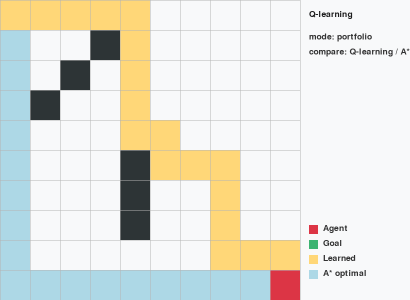
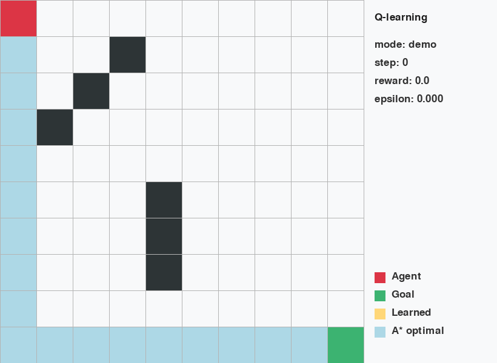
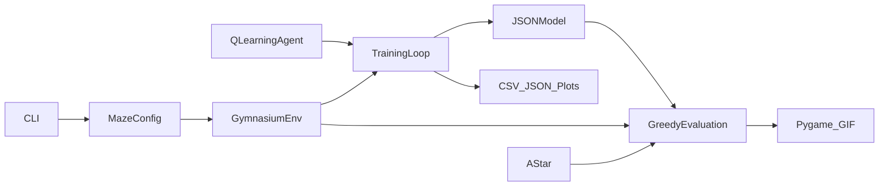

# Static Maze Solver

[](https://github.com/Haider-Dev01/Static-maze-solver/actions/workflows/ci.yml)
[](https://www.python.org/)
[](https://gymnasium.farama.org/)
[](LICENSE)

Un environnement de labyrinthe **Gymnasium** et un agent de **Q-learning tabulaire** reproductible, évalué face à une baseline optimale A*. Le projet couvre tout le cycle d'une expérience RL : entraînement, évaluation gloutonne, sauvegarde du modèle, métriques, benchmark multi-seed et démonstration Pygame.



## Résultats vérifiés

Benchmark local réalisé sur **9 labyrinthes générés** (tailles 5×5, 8×8 et 10×10, 3 seeds par taille), avec 500 épisodes maximum :

- **100 % de réussite** sur les 9 configurations ;
- chemin glouton égal au chemin optimal A* sur les 9 configurations ;
- convergence avec arrêt anticipé après 299 épisodes pour chaque configuration ;
- **90 % de couverture de tests** (`29 passed`).

Sur le preset classique 10×10, l'agent atteint **100 % de réussite sur 100 évaluations**, en 18 étapes en moyenne, soit la longueur optimale A*.

Ces chiffres sont reproductibles avec les commandes de la section [Benchmark](#benchmark). Les résultats bruts sont générés dans `artifacts/`.

## Démonstration



La grille affiche :

- le chemin de l'agent en jaune ;
- le chemin optimal A* en bleu ;
- les obstacles en gris ;
- l'objectif en vert et l'agent en rouge.

## Architecture

```text
Static-maze-solver/
├── src/static_maze_solver/
│   ├── agent.py           # Agent Q-learning et persistance JSON
│   ├── baseline.py        # Solveur optimal A*
│   ├── cli.py             # Commandes train/evaluate/demo/benchmark
│   ├── environment.py     # Environnement Gymnasium et rendu Pygame
│   ├── maze.py            # Presets et génération reproductible
│   ├── metrics.py         # CSV, JSON et courbes de convergence
│   ├── training.py        # Boucles d'entraînement et d'évaluation
│   └── visualization.py   # Export GIF et PNG
├── tests/                 # Tests unitaires et end-to-end
├── docs/assets/           # Supports de démonstration
├── .github/workflows/     # Intégration continue
└── pyproject.toml         # Package, dépendances et outils qualité
```



## Fonctionnalités

- API Gymnasium moderne avec `terminated` et `truncated` ;
- espace d'observation `MultiDiscrete` cohérent ;
- validation du départ, de l'objectif, des obstacles et de l'accessibilité ;
- limite de pas garantissant la fin de chaque épisode ;
- Q-learning terminal-aware et politique ε-greedy reproductible ;
- décroissance de l'exploration, évaluation avec `epsilon = 0` ;
- sauvegarde portable et versionnée de la Q-table en JSON ;
- presets et génération de labyrinthes aléatoires toujours solvables ;
- entraînement rapide sans interface ou démonstration Pygame ;
- métriques CSV/JSON, courbes de convergence et arrêt anticipé ;
- comparaison de la longueur du chemin avec A* ;
- benchmark sur plusieurs tailles et seeds ;
- export automatique d'une démonstration GIF et d'une capture PNG ;
- tests, typage strict, lint, formatage et CI multi-version.

## Installation

Prérequis : **Python 3.12 ou version ultérieure**.

```bash
git clone https://github.com/Haider-Dev01/Static-maze-solver.git
cd Static-maze-solver
python -m venv .venv
```

Activation sous Windows :

```powershell
.\.venv\Scripts\Activate.ps1
```

Activation sous Linux/macOS :

```bash
source .venv/bin/activate
```

Installation :

```bash
python -m pip install -e .
```

Pour contribuer :

```bash
python -m pip install -e ".[dev]"
```

Le projet utilise `pygame-ce`, compatible avec Python 3.14 et importé sous le nom standard `pygame`.

## Démarrage rapide

### Entraîner

```bash
maze-solver train \
  --maze classic \
  --episodes 800 \
  --seed 42 \
  --epsilon-decay 0.99 \
  --output artifacts/portfolio
```

Cette commande crée :

- `q_table.json` : modèle entraîné ;
- `train_episodes.csv` : métriques par épisode ;
- `train_summary.json` : résumé et configuration ;
- `convergence.png` : courbe de récompense et taux de réussite.

### Évaluer

```bash
maze-solver evaluate \
  --maze classic \
  --model artifacts/portfolio/q_table.json \
  --episodes 100 \
  --output artifacts/portfolio
```

L'évaluation est gloutonne : aucune exploration et aucune modification de la Q-table.

### Afficher une démonstration

```bash
maze-solver demo \
  --maze classic \
  --model artifacts/portfolio/q_table.json
```

### Exporter un GIF et une image

```bash
maze-solver demo \
  --maze classic \
  --model artifacts/portfolio/q_table.json \
  --record docs/assets/demo.gif \
  --snapshot docs/assets/demo.png
```

### Générer un labyrinthe

```bash
maze-solver train \
  --maze generated \
  --rows 12 \
  --cols 12 \
  --obstacle-density 0.2 \
  --seed 21
```

Toutes les commandes sont aussi accessibles avec :

```bash
python -m static_maze_solver --help
```

## Benchmark

Pour reproduire les résultats annoncés :

```bash
maze-solver benchmark \
  --sizes 5,8,10 \
  --seeds 7,21,42 \
  --episodes 500 \
  --eval-episodes 30 \
  --output artifacts/benchmark
```

La baseline A* mesure le nombre minimal de déplacements. Le ratio d'efficacité correspond à :

```text
nombre de pas de l'agent / nombre de pas optimal A*
```

Un ratio de `1.0` indique un chemin optimal.

## Tests et qualité

```bash
pytest
ruff check .
ruff format --check .
mypy
```

La CI exécute ces contrôles avec Python 3.12, 3.13 et 3.14. Le seuil minimal de couverture est fixé à 80 %.

## Algorithme

La Q-table associe chaque position `(ligne, colonne)` à quatre valeurs d'action. Après une transition, la mise à jour est :

```text
Q(s, a) ← Q(s, a) + α × [r + γ × max Q(s', a') - Q(s, a)]
```

Pour une transition terminale, la valeur future est nulle. Pendant l'entraînement, l'agent explore avec une probabilité ε décroissante. Pendant l'évaluation, il choisit toujours une action parmi les meilleures valeurs apprises.

Actions :

| Valeur | Direction |
|---:|---|
| `0` | Haut |
| `1` | Bas |
| `2` | Gauche |
| `3` | Droite |

## Limites et évolutions possibles

- le Q-learning tabulaire est adapté aux petites grilles, mais sa mémoire augmente avec le nombre d'états ;
- les labyrinthes générés sont statiques pendant un épisode ;
- une prochaine comparaison pourrait ajouter SARSA ;
- un DQN serait pertinent pour des observations visuelles ou des espaces beaucoup plus grands ;
- une interface web pourrait compléter la démonstration Pygame.

## Formulation CV

> Développement d'un environnement Gymnasium et d'un agent Q-learning tabulaire reproductible, évalué face à A* sur 9 labyrinthes de 3 tailles ; 100 % de réussite et chemins optimaux lors du benchmark, avec CLI, visualisation Pygame, CI multi-version et 90 % de couverture de tests.

## Licence

Distribué sous licence [MIT](LICENSE).
